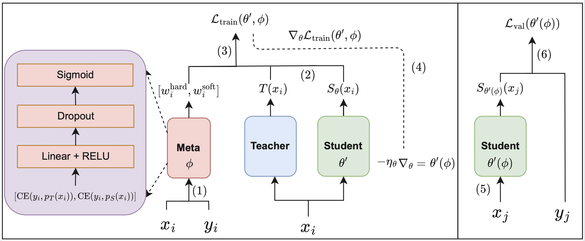

## 1. Overview

This is the Pytorch implementation for "Balancing Knowledge Distillation for Imbalance Learning with Bilevel Optimization".

Authors: Ba Tho Phan, Ba Hoang Anh Nguyen, Viet Cuong Ta

<p align="center">
  
</p>

## 2. Setup

### 2.1 Environment
To install the required dependencies, run: `pip install -r requirement.txt`

### 2.2 Computational Resources
All experiments run in Kaggle notebook.

## 3. Usage & Experiments
### 3.1 Proposed Method (Meta-Balancing)
To train the student model using our proposed bilevel optimization method, run the `bilevel_balancing_kd.py` script.
```
python bileval_balancing_kd.py --dataset cifar100 --teacher_path your_path_here.pth --imb_factor 100 --inner_accum_steps 5
```

### 3.2 Baseline
This repository currently support 5 methods:
kd', 'ce', 'dive', 'bkd', 'wsl
- `ce` - standard cross entropy loss
- `kd` - vanilla knowledge distillation
- `dive` - distill from virtual examples
- `bkd` - balanced knowledge distillation
- `wsl` - weighted soft labels

To train a standard student model without meta-balancing, run the `train_student.py` script.
```
python train_student.py --dataset cifar100 --imb_factor 100 --teacher_ckpt_path your_path_here.pth --kd_type dive --alpha 0.5 --power
```

### 3.3 Arguments
Below is a description of the key arguments used in the scripts:
| Argument                 | Description                                                 |
| ------------------------ | ----------------------------------------------------------- |
| `--dataset`               | Data to use (e.g. `cifar10`, `cifar100`      |
| `--imb_factor`       | Imbalance factor for long-tailed datasets (1, 10, 50, 100) |
| `--teacher_arch` | Architecture of the teacher network (e.g., `resnet32x4`). |
| `--student_arch` | Architecture of the student network (e.g., `resnet8x4`). |
| `--teacher_ckpt_path` | Path to the pre-trained teacher model checkpoint. |
| `--kd_type`              | KD method (`kd`, `ce`, `dive`, `bkd`, `wsl`). Default: `kd`.|
| `--alpha`                | Balancing weight for the loss function. Default: `0.5`.     |
| `--power`                | (Flag) Use power normalization (p=0.5) for teacher probs.   |

Specialize arguments for Bilevel balancing KD
| Argument                 | Description                                                 |
| ------------------------ | ----------------------------------------------------------- |
| `--hidden_wnet` | Hidden layers for wnet |
| `--inner_accum_steps` | Accumulation steps for inner update of inner model |


## 4. Acknowledgement
We thank the Pytorch implementation on [mwn](https://github.com/xjtushujun/meta-weight-net). We appreciate the following open-source repositories, which we used as baselines for our experiments [bkd](https://github.com/EricZsy/BalancedKnowledgeDistillation) and [wsl](https://github.com/bellymonster/Weighted-Soft-Label-Distillation)
